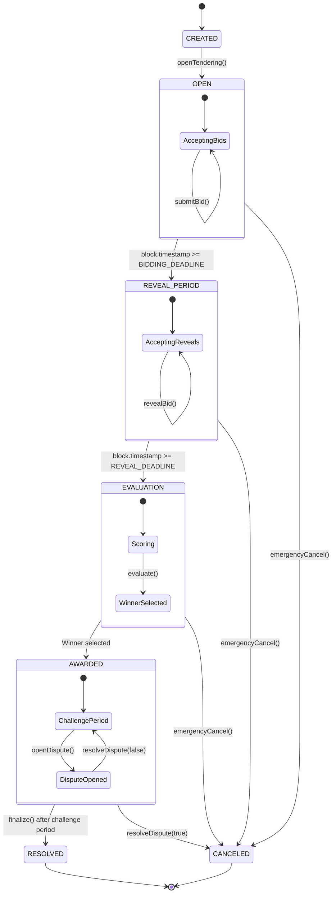

# State Machine Specification

> **Document Type:** Technical Specification  
> **Last Updated:** 2026-01-07  
> **Status:** Production

---

## Overview

The `Tender` contract implements a **finite state machine** ensuring tenders progress irreversibly through valid states. This document defines each state, allowed operations, invariants, and transition conditions.

---

## State Definitions

| # | State | Description |
|---|-------|-------------|
| 1 | `CREATED` | Contract deployed, awaiting configuration |
| 2 | `OPEN` | Accepting bid commitments + bonds |
| 3 | `REVEAL_PERIOD` | Accepting bid reveals + ZK proofs |
| 4 | `EVALUATION` | Scoring and selecting winner |
| 5 | `AWARDED` | Winner announced, challenge period active |
| 6 | `RESOLVED` | Challenge period complete, funds claimable |
| 7 | `CANCELED` | Emergency termination, bonds refundable |

---

## State Transition Rules

### 1. CREATED

**Entry Conditions:**
- Contract deployed by `TenderFactory`

**Allowed Operations:**
- Configure parameters (IPFS hash, deadlines, bond amount)

**Exit Transition:**
- `openTendering()` → `OPEN` (Authority only)

---

### 2. OPEN

**Entry Conditions:**
- Authority called `openTendering()`

**Invariants:**
- `block.timestamp < BIDDING_DEADLINE`

**Allowed Operations:**
| Function | Actor | Requirements |
|----------|-------|--------------|
| `submitBid(commitment, proof, signals)` | Bidder | `msg.value >= BID_BOND_AMOUNT`, identity verified |

**Exit Transitions:**
- `block.timestamp >= BIDDING_DEADLINE` → `REVEAL_PERIOD` (automatic on next interaction)
- `emergencyCancel()` → `CANCELED` (Authority only)

---

### 3. REVEAL_PERIOD

**Entry Conditions:**
- `block.timestamp >= BIDDING_DEADLINE`

**Invariants:**
- `block.timestamp < REVEAL_DEADLINE`

**Allowed Operations:**
| Function | Actor | Requirements |
|----------|-------|--------------|
| `revealBid(amount, salt, metadata)` | Bidder | `hash(amount, salt, metadata) == commitment` |

**Exit Transitions:**
- `block.timestamp >= REVEAL_DEADLINE` → `EVALUATION` (automatic on next interaction)
- `emergencyCancel()` → `CANCELED` (Authority only)

---

### 4. EVALUATION

**Entry Conditions:**
- `block.timestamp >= REVEAL_DEADLINE`

**Allowed Operations:**
| Function | Actor | Requirements |
|----------|-------|--------------|
| `evaluate()` | Authority | At least one valid revealed bid |

**Exit Transitions:**
- `evaluate()` success → `AWARDED`
- No valid bids → Revert with `NoValidBids()`
- `emergencyCancel()` → `CANCELED` (Authority only)

---

### 5. AWARDED

**Entry Conditions:**
- `evaluate()` completed successfully
- `winningBidderId` set

**Invariants:**
- Challenge period: `block.timestamp < challengeDeadline`

**Allowed Operations:**
| Function | Actor | Requirements |
|----------|-------|--------------|
| `openDispute(reason)` | Any participant | Within challenge period |
| `resolveDispute(id, upheld)` | Authority | Dispute must exist |

**Exit Transitions:**
- `finalize()` after challenge period → `RESOLVED`
- `resolveDispute(_, true)` (dispute upheld) → `CANCELED`

---

### 6. RESOLVED (Final State)

**Entry Conditions:**
- Challenge period expired or disputes dismissed
- `finalize()` called

**Allowed Operations:**
| Function | Actor | Requirements |
|----------|-------|--------------|
| `withdrawBond()` | Non-winner bidders | Bond not forfeited |
| `claimSlashedFunds()` | Winner | Slashed funds available |

---

### 7. CANCELED (Final State)

**Entry Conditions:**
- `emergencyCancel()` called, OR
- Dispute upheld via `resolveDispute(_, true)`

**Allowed Operations:**
| Function | Actor | Requirements |
|----------|-------|--------------|
| `withdrawBond()` | All bidders | Full bond refund |

---

## State Diagram

---

## Invariants

The following invariants are **enforced at all times** and verified via stateful fuzzing:

| ID | Invariant | Description |
|----|-----------|-------------|
| INV-1 | **Time Monotonicity** | `REVEAL_DEADLINE > BIDDING_DEADLINE` |
| INV-2 | **Bond Integrity** | Bid submission requires `msg.value >= BID_BOND_AMOUNT` |
| INV-3 | **Commitment Integrity** | Reveal valid iff `hash(value, salt, metadata) == commitment` |
| INV-4 | **Immutability** | Committed bids cannot be modified |
| INV-5 | **Single Winner** | Exactly one `winningBidderId` after evaluation |
| INV-6 | **State Monotonicity** | State never decreases (forward-only progression) |
| INV-7 | **Solvency** | `address(this).balance >= sum(activeBonds)` |

---

## Related Documents

- [Threat Model](../security/threat-model.md) — Attack vectors and mitigations
- [Trust Assumptions](./assumptions_trust.md) — System dependencies and guarantees
