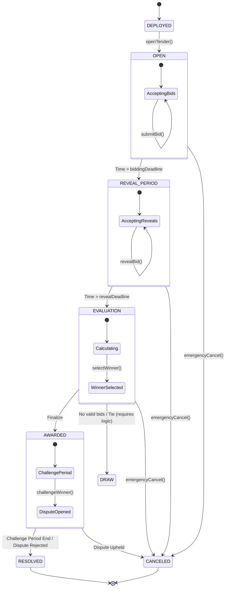

# State Machine Specification

## 1. Tender Lifecycle
The `Tender` contract drives the core logic. It follows a strict unidirectional flow (mostly).

### States
1. **`DEPLOYED` / `DRAFT`**
   - Contract created by `TenderFactory`.
   - Authority can configure parameters (IPFS hash of specs, deadlines, deposit amount).
   - *Transition*: Authority calls `openTendering()`.

2. **`OPEN` (Bidding Phase)**
   - **Allowed**: `submitBid(hash)`
   - **Disallowed**: `revealBid()`, `finalize()`
   - **Invariant**: `block.timestamp < biddingDeadline`
   - Bidders submit cryptographic commitments (Hash of bid data + salt) + Deposit (Bid Bond).

3. **`CLOSED` (Interim - Optional)**
   - Time has passed `biddingDeadline` but `revealStartTime` hasn't started (if gap exists).
   - Usually `OPEN` transitions directly to `REVEAL`.

4. **`REVEAL_PERIOD`**
   - **Allowed**: `revealBid(amount, salt)`
   - **Invariant**: `block.timestamp >= biddingDeadline` AND `block.timestamp < revealDeadline`
   - Bidders reveal their actual bid values. Contract verifies `keccak256(amount, salt) == storedHash`.
   - Valid bids are stored in a list.

5. **`EVALUATION` (Scoring)**
   - **Allowed**: `evaluate()` / `score()`
   - **Invariant**: `block.timestamp >= revealDeadline`
   - Can be automated (for lowest price) or semi-automated (scoring engine).
   - If "Lowest Price" logic: The contract automatically finds the lowest valid revealed bid.

6. **`AWARDED`**
   - The winner is selected.
   - **Challenge Period Starts**: Users can open disputes.
   - **Actions**:
     - `challengeWinner()`: Opens a dispute.
   - **Transitions**:
     - -> `RESOLVED`: After challenge period ends with no successful disputes.
     - -> `CANCELED`: If a dispute is upheld.

7. **`RESOLVED`**
   - Challenge period over, or disputes dismissed.
   - **Actions**:
     - `withdrawBond()`: Losers withdraw bonds.
     - Winner claims payout (implicit in logic or manual claim).
   - **Final State**.

8. **`CANCELED`**
   - Available from `OPEN` or `REVEAL_PERIOD` if Authority cancels (emergency).
   - Also reached from `AWARDED` if a dispute is upheld (`resolveDispute(true)`).
   - All bonds refundable.
   - **Final State**.

## 2. Diagram (Mermaid)

## 3. Explicit Constraints & Invariants
1. **Time Monotonicity**: Deadlines must be in future relative to previous states. `revealDeadline > biddingDeadline`.
2. **Bond Integrity**: A bid cannot be submitted without `msg.value >= bidBondAmount`.
3. **Commitment Integrity**: A reveal is only valid if `hash(value, salt) == committedHash`.
4. **Immutability**: Once a bid is committed, it cannot be changed.
5. **Single Winner**: (For simple tenders) Only one address acts as winner.
